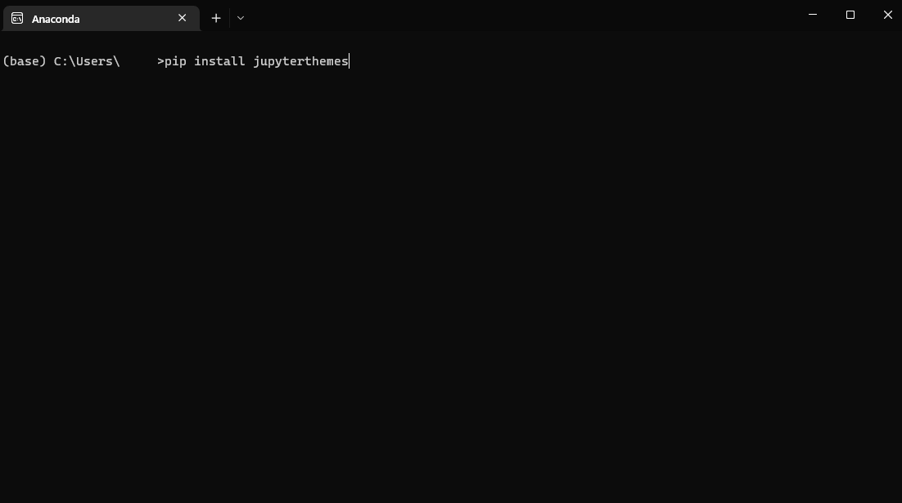
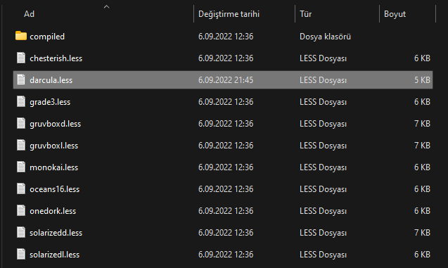
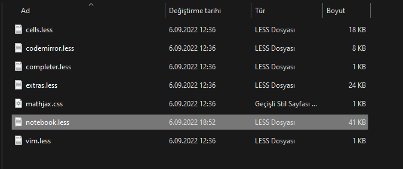
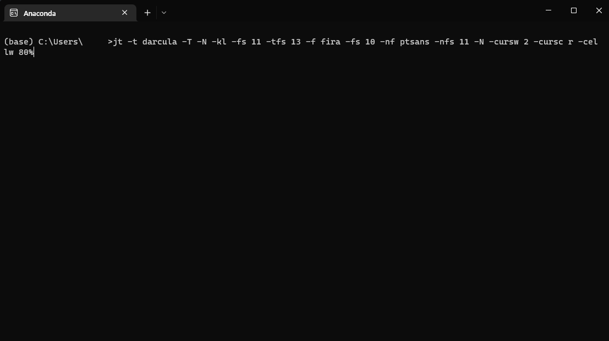
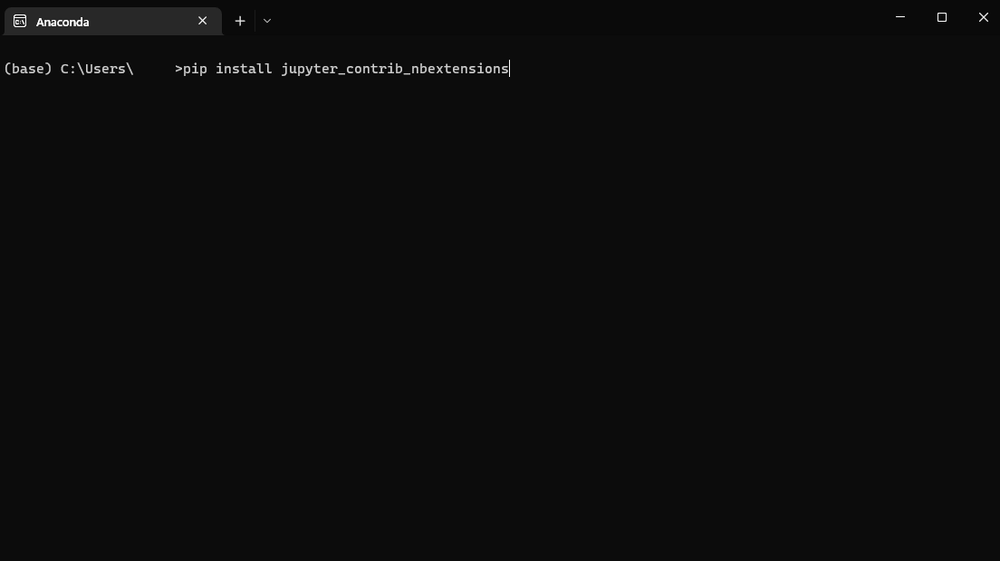
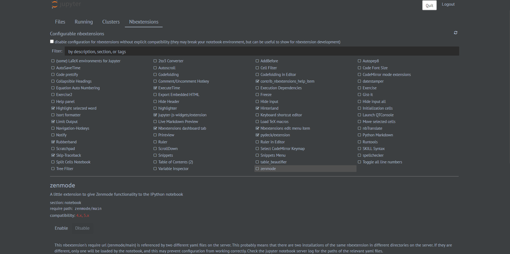
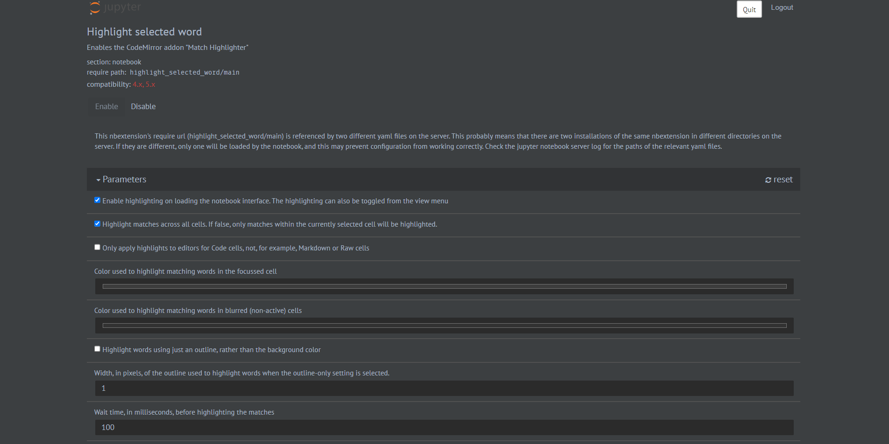
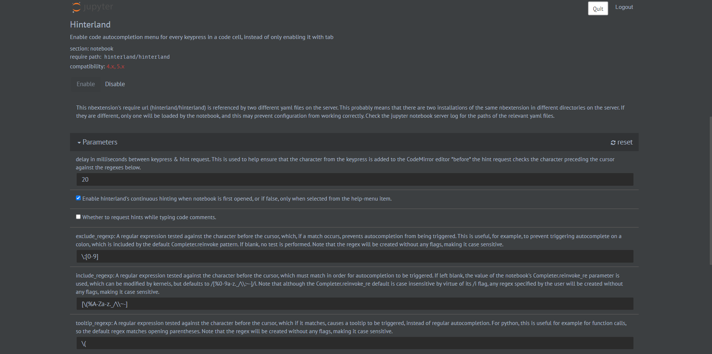
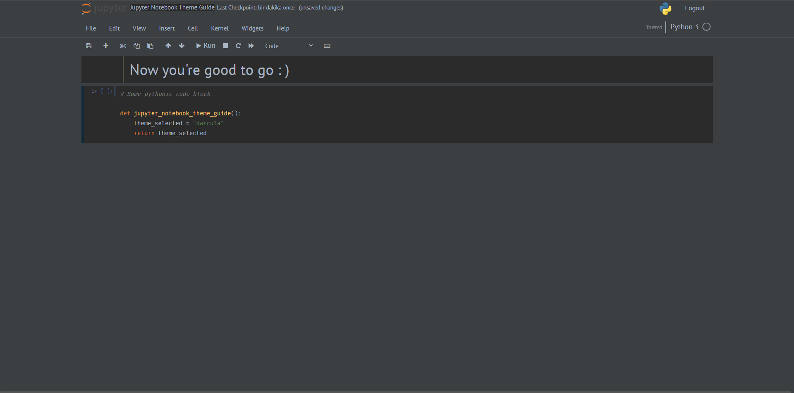

# Jupyter Notebook Darcula Theme Guide

Implementation of Pycharm Darcula Theme and extensions for Jupyter Notebook.

### 1. Download Jupyter Themes

Open the cmd enviroment that you use and type **pip install jupyterthemes**



### 2. Placing the style file

Go to **C:/Users/[user]/anaconda3/Lib/site-packages/jupyterthemes/styles** and create a file named **darcula.less** in this folder.



Then add style codes below to **darcula.less** file.

```text
/* darcula base colors */
@yellow: #FFC66D;
@orange: #CC7832;
@red: #BC3F3C; 
@magenta: #DB797C;
@violet: #9876AA;
@blue: #6897BB; 
@cyan: #51b6c3;
@green: #6A8759;
@code-gray: #A9B7C6;
@code-fg: #A9B7C6; 
@code-yellow: @yellow;
@code-red: @red;
@code-violet: @violet;
@code-green: @green;
@code-blue: @blue;
@code-orange: @orange;
@code-cyan: @cyan;
@theme-flavor: #000000;
@theme-flavor-inverse: #ffffff;
@text-default: #A9B7C6;
@editor-bg: #2b2b2b;

/* darcula notebook colors */
@notebook-bg: #3C3F41;
@notebook-fg: @text-default;
@notebook-base: @editor-bg; 

/* jtplot figure style */
@axisFace: #3E434C;
@figureFace: #3E434C;
@textColor: #A9B7C6;
@edgeColor: #313B45; 
@gridColor: #546379;

/* selection, hover, prompts, brackets colors */
@selected-bg: #0D293E;
@selected-half: #515151;
@selected-third: #515151;
@selected-tenth: @item-blue;
@selected-error: @violet;
@selected-active: @selected-bg;
@navbar-selected: @item-blue;
@selected-fg: @text-default;
@selected-fg-bright: @text-default;
@unemphasize-fg: @text-default; 

/* code, text, markdown, & tooltip colors */
@cc-input-bg: @editor-bg;
@cc-input-fg: @text-default;
@cc-output-bg-default: @editor-bg;
@cc-output-fg: @text-default;
@text-cell-fg: @text-default;
@unrendered-text: @text-default;
@header-fg: @text-default;
@tooltip-bg-color: @notebook-bg;
@tooltip-fg-color: @text-default;
@nb-name-fg: @text-default;
@nb-name-hover: @text-default; 

/* cell border colors */
@cc-border-selected: @selected-bg;
@cc-border-edit: @selected-bg; 
@tc-border-selected: #48536f;
@tc-border-edit: @tc-border-selected;

/* menus, dividers, prompt-borders, brackets */
@divider: #515151;
@disabled: @text-default;
@disabled: @text-default; 
@input-prompt: #526488;
@input-hover-bg: @item-blue;
@prompt-hover-color: @item-blue;
@prompt-line: @item-blue;
@tc-prompt-std: rgba(148, 204, 114, .3);
@matching-bracket: #3B514D;
@menubar-bg: @notebook-bg;
@menubar-fg: @text-default;
@menubar-hover: @item-blue;
@nb-header-bg: @notebook-bg;
@nb-header-fg: @text-default;
@dropdown-bg: @notebook-bg; 
@dropdown-border: @selected-third;
@dropdown-hover: @item-blue; 

/* panels and form-control styles */
@panel-header-bg: #313335;
@panel-bg: @notebook-bg;
@modal-bg: @panel-bg;
@alert-info-bg: #4a5467;
@form-input-bg: @codeblock-bg;
@form-input-border: @codeblock-bg;
@cmd-palette-bg: #202937;
@cmd-palette-form: #293547;
@cmd-palette-hover: #2b3850;

/* buttons, widgets, kernels colors */
@item-theme: @text-default;
@item-blue: #4B6EAF;
@item-cyan: @blue;
@item-green: #A5C261;
@item-red: @red;
@item-orange: #fea47f;

@item-danger: @red;
@item-success: @green;
@item-info: @blue;
@item-warning: #ff914d;

/* tables and dataframes colors */
@table-color: #DBDFEF;
@table-bg: #414B5E;
@table-border: #546379;
@df-header-bg: #313335;
@df-header: #D4D8EC;
@df-header-border: #414C5D;
@df-cell-bg: #434d61;
@codeblock-bg: @editor-bg;
@codeblock-border: @codeblock-bg;

/* btn, scrollbar and shadow colors */
@button-bg: @notebook-bg;
@button-border: @button-bg;
@button-color: @notebook-fg;
@button-hover: @text-default;
@button-hover-bg: #515658;
@button-hover-border: #515658;
@button-focus-bg: #365880;
@button-focus-fg: @text-default;
@button-panel-bg: #4C5052;
@button-panel-hover: #4C5052;
@scrollbar: #565656;
@scroll-trough: #3C3F41;
@scrollbar-inactive: #3C3F41;
@box-shadow: #3e4444; 
@md-header-link: rgba(0, 0, 0, .32);

/* darcula ansi colors */
@ansiblack: @editor-bg;
@ansiblue: @blue;
@ansigray: @text-default;
@ansigreen: @green;
@ansipurple: @violet;
@ansicyan: @cyan;
@ansiyellow: @yellow;
@ansired: @red;
@stderr-bg: @editor-bg;
@stderr-fg: @red;
@js-error: @stderr-bg;

/* darcula codemirror colors */
@cm-selected: #214283;
@cm-gutters: #313335;
@cm-linenumber: #606366;
@cm-comment: #808080;
@cm-atom: @orange;
@cm-number: @blue;
@cm-property: #FFC66D;
@cm-attribute: #94558D;
@cm-keyword: @orange;
@cm-string: #6A8759;
@cm-meta: #BBB529;
@cm-operator: #A9B7C6;
@cm-builtin: #8888C6;
@cm-variable: @text-default;
@cm-variable2: #94558D; 
@cm-variable3: @violet;

@cm-def: @yellow;
@cm-error: #692A27;
@cm-tag: #629755;
@cm-link: @orange;
@cm-storage: @text-default;
@cm-entity: @text-default;
@cm-latex: @orange; 

```

### 3. Some changes for optimization

1. Open **C:/Users/[user]/anaconda3/Lib/site-packages/notebook/static/style/style.min.css** and add style css code below.

```text
.container.toolbar {
 background: #3c3f41;
 margin-top: auto;
 margin-bottom: auto;
 margin-right: auto;
 margin-left: -10px !important;
}
```


2. Open **C:/Users/[user]/anaconda3/Lib/site-packages/jupyterthemes/layout/notebook.less**



- Then remove this part from the file.

```text
div#ipython_notebook {
    display: none;
}
```

- And modify span.checkpoint_status part like that

```text
span.checkpoint_status, span.autosave_status {
    font-size: small;
}
```

### 4. Jupyter Notebook Adjustments

Open console and type **jt -t darcula -T -N -kl -fs 11 -tfs 13 -f fira -fs 10 -nf ptsans -nfs 11 -N -cursw 2 -cursc r -cellw 80%**



### 5. Setting Extensions

Now pip install **pip install jupyter_contrib_nbextensions** for extension tool.



Then and open jupyter notebook.

You will see a header named Nbextensions, click it.

Under the Configurable nbextensions enable extensions below.

- Highlight selected word
- Limit Output
- Rubberband
- Skip-Traceback
- ExecuteTime
- jupyter-js-widgets/extension
- Nbextensions dashboard tab
- contrib_nbextensions_help_item
- Hinterland
- Nbextensions edit menu item
- pydeck/extension



For **Highlight selected word**, go down and change the colors to gray.

RGB(60, 60, 60) for "Color used to highlight matching words in the focussed cell"
RGB(50, 50, 50) for "Color used to highlight matching words in blurred (non-active) cells"



For **Hinterland**, go down and change regexp settings.

\\:[0-9] for "exclude_regexp"

[\(%A-Za-z._/\\~-] for "include_regexp"



It's done. Now you're good to go.

